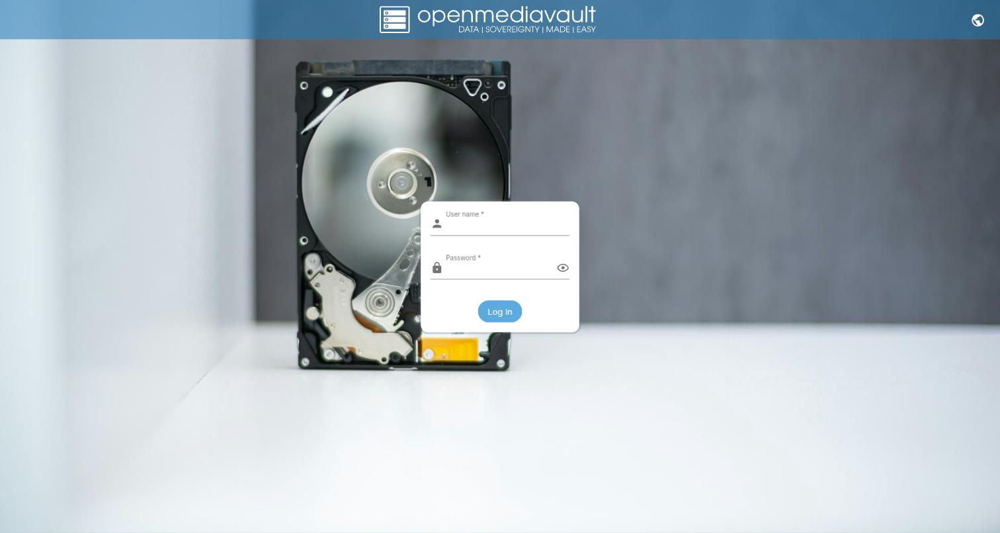

# Iron Cow RK3568 NAS → Armbian + OpenMediaVault

[](LICENSE)



A complete, end-to-end tested, step-by-step guide to replacing the factory
firmware (which phones home) on an "Iron Cow" RK3568-based NAS with Armbian +
OpenMediaVault, using a Raspberry Pi as a debug console and transfer bridge.
This includes every real problem hit along the way and how it was solved, not
just the commands that worked in the end.

The whole process was done entirely over a UART serial console, without
needing to open the case beyond reaching the internal debug header, and
without risking the eMMC until everything was validated over USB first.

> **Note:** every value like IPs, UUIDs, usernames, and passwords in this
> guide is a generic placeholder (`<nas-ip>`, `<uuid>`, `/dev/sdX`, etc.).
> Always replace them with your own hardware's real values — never copy a
> value from this guide as if it were literal.

## Why

This NAS's factory firmware:
- Calls `portal.iron-cow-ainas.com` (and variants) on every boot, even with no
  user configuration — unsolicited telemetry/phone-home.
- Runs a remote-access VPN tunnel (`tunsvr`) enabled by default.
- Has an additional monitoring daemon (`nasMonitor.py`).
- Its eMMC also showed real I/O errors at boot (flaky hardware, not a
  corrupted filesystem — confirmed with `e2fsck`).

## Credit

The patched device tree for this NAS (`rk3568-nas.dtb`) comes from
**gloriouspidgeon855**'s public repository:
https://github.com/gloriouspidgeon855/IroncowNASArmbian
This guide documents the full process around that device tree: how to get to
it, how to test it safely, and how to get it booting automatically from
internal eMMC with OpenMediaVault installed and running.

## What you need

- The Iron Cow NAS (RK3568), with physical access to its internal UART debug
  header.
- A Raspberry Pi (a Pi 5 was used) to act as the serial console and network
  bridge.
- 3 female-to-female jumper wires.
- A microSD or USB flash drive of at least 8GB for testing (the eMMC isn't
  touched until the very end).
- A direct Ethernet cable (or USB-Ethernet adapter) between the Pi and the NAS
  to transfer large files without depending on shared network infrastructure.

---

## Part 1 — UART serial console

**Wiring (with the NAS powered off):**

| Pi (GPIO header) | NAS (debug header) |
|---|---|
| Pin 8 (GPIO14 / TXD) | RX |
| Pin 10 (GPIO15 / RXD) | TX |
| Pin 6 (GND) | GND |

**Do not connect the 3.3V pin.**

**On the Pi:**

```bash
sudo raspi-config
# Interface Options → Serial Port
#   "login shell over serial" → No
#   "hardware serial port" → Yes
# Reboot
```

Confirm `/dev/serial0` (or `/dev/ttyAMA0`) exists after the reboot.

```bash
sudo apt install screen
sudo screen /dev/serial0 1500000
```

Power on the NAS and you should see boot ROM / U-Boot / Debian boot log
output. Garbled text = wiring reversed or wrong baudrate. Nothing at all =
check wiring/power.

---

## Part 2 — Breaking into U-Boot with no physical recovery button

The physical recovery button (rear pinhole) **did not work** on any attempt on
this NAS — don't assume it as your first option.

This NAS's U-Boot (Rockchip vendor U-Boot 2017.09) has `bootdelay=0` (no
human-reaction-time window), but because it honors
`CONFIG_ZERO_BOOTDELAY_CHECK`, a Ctrl+C byte already sitting in the UART RX
buffer at the exact instant of boot still stops it.

**Technique:** a Python script (pyserial) that floods `\x03` (Ctrl+C) in a
tight loop for ~45s while the NAS is powered on (or rebooted) *during* that
window.

See [`scripts/uboot_break.py`](scripts/uboot_break.py). Usage:

```bash
python3 scripts/uboot_break.py
# the script tells you when to start — that's when you power on the NAS
```

You'll see `=> <INTERRUPT>` repeated in the output when it works — that's the
U-Boot prompt (`=>`).

If the NAS is already powered on and running Linux (not off), use
[`scripts/reboot_and_break.py`](scripts/reboot_and_break.py) instead, which
triggers the reboot via `sysrq` **before** starting the flood — important:
start the flood *before* sending the reboot trigger, not after, since
systemd's shutdown sequence can take several unpredictable seconds and eat the
whole window if the flood starts late.

---

## Part 3 — Persistent root access, without knowing the password

From the U-Boot `=>` prompt:

```
setenv bootargs "${bootargs} init=/bin/sh"
boot
```

This boots straight into a root shell (`/bin/sh` as PID 1), bypassing login
entirely. It's a one-boot-only change (no `saveenv` was used), so it doesn't
touch anything persistent on the eMMC.

The environment is minimal — no `/proc`, `/sys`, or `/etc/mtab` mounted:

```sh
mount -t proc proc /proc
mount -t sysfs sysfs /sys
```

Confirm that root (`/`, typically `mmcblk0p6` on this model) is mounted `rw`
(it was in this case despite the kernel cmdline's `ro` parameter, which this
U-Boot ignores). Then:

```sh
passwd          # set a root password
sync
reboot -f
```

From then on, log in normally as `root` with the password you set, no more
need for the U-Boot dance for basic access.

---

## Part 4 — eMMC health check

The factory firmware showed real I/O errors at boot
(`blk_update_request: I/O error`, `mmc0: Timeout waiting for hardware interrupt`,
`cache flush error -110`). Before assuming the filesystem was corrupted:

```sh
e2fsck -n /dev/mmcblk0p6     # -n: report only, don't modify anything
```

In this case: 0 structural errors across all 5 passes. The boot-time errors
were **eMMC controller-level hardware flakiness**, not filesystem corruption
— not fixable via fsck, but stable enough to boot the OS as long as the NAS's
actual data lives on SATA drives, not the eMMC.

---

## Part 5 — Disabling the factory phone-home / backdoor

The factory firmware's `/etc/rc.local` launched three
telemetry/remote-access processes on every boot:

- `check_rtcp.sh` → calls `check_rtcp.lua` every 5min, which `curl`s a
  "portal" URL (historically `portal.iron-cow-ainas.com`, with an old
  commented-out value `portal.wocyber.com` as a possibly related vendor).
- `tunsvr /etc/server.ini` → the remote-access VPN tunnel.
- `nasMonitor.py` → telemetry/monitoring.

These were disabled by commenting out their launch lines in `/etc/rc.local`
(takes effect after a reboot). The nginx logs
(`/usr/local/openresty/nginx/logs/error.log`) showed that this specific unit
**had been cloud-paired before** (QR-code login flow against
`us-portal.iron-cow-ainas.com`) — that pairing state may still be live
server-side on the manufacturer's end even though it no longer calls out
locally.

**Also worth knowing (not touched, but be aware):** `rc.local` runs
`rm -rf /disk0/* /disk1/* /disk2/*` on every boot. Harmless with empty/
disconnected SATA drives, but destructive if you ever boot the factory
firmware with real drives mounted there unintentionally.

This part only matters if you're going to keep using the factory firmware for
a while before replacing it. If you're going straight to Armbian, you can
skip it.

---

## Part 6 — Getting the Armbian device tree

Instead of reverse-engineering the device tree from scratch, use the one
already built and tested by the community:
https://github.com/gloriouspidgeon855/IroncowNASArmbian

Key files from that repo:
- `rk3568-nas.dtb` / `.dts` — compiled against kernel 6.12, derived from the
  stock `.dtb` compared against the mainline QNAP TS433 `.dts` (similar
  hardware).
- `armbianEnv.txt` / `extlinux.conf` — boot configs. **Both need their
  `UUID=` value edited to match the actual root partition UUID of whatever
  image you end up using** — without this, the board won't boot (drops to an
  emergency shell). That repo's own README stresses this too.
- `armbianOnAUSBStick.md` — documents testing over USB before touching the
  eMMC, and confirms the same Ctrl+C-flood technique used here.
- Note on the NAS's USB port: it defaults to *device* mode (client) and needs
  to be flipped to *host* mode for a USB stick to be recognized:
  ```sh
  echo host > /sys/kernel/debug/usb/fcc00000.dwc3/mode
  ```
  (alternate path seen in the factory firmware's `rc.local`:
  `/sys/devices/platform/fe8a0000.usb2-phy/otg_mode` — may be board-revision
  dependent, try both if one doesn't exist).
- That repo's `unspyware.sh` — **don't use it as-is**: despite the name, it
  *enables* `tunsvr`/`check_rtcp.lua` instead of disabling them — the opposite
  of Part 5.

Also download a current Armbian image for the closest available board (an
**Odroid M1S**, also RK3568, was used) from armbian.com — Debian 13 (trixie)
minimal.

---

## Part 7 — Test over USB first, never straight to eMMC

**Don't touch the eMMC without having successfully booted Armbian from a USB
flash drive or microSD first.**

1. Write the downloaded Armbian image to a USB flash drive/microSD:
   ```sh
   xzcat armbian_....img.xz | sudo dd of=/dev/sdX bs=4M status=progress conv=fsync
   ```
2. **Always verify checksums of the freshly written file against the
   original.** In this process, a `dd`/pipe that "finishes without error" is
   **not** proof of integrity — real silent corruption was found from a write
   like this (see Part 9, the same pattern repeats twice in this guide). Mount
   the USB drive's partition and compare `md5sum` file by file against the
   original (you can loop-mount the decompressed `.img` with
   `udisksctl loop-setup -f file.img`, no sudo needed).
3. Copy `rk3568-nas.dtb`, `armbianEnv.txt` (with the UUID corrected to the USB
   drive's real partition) and `extlinux/extlinux.conf` (same UUID, and
   `FDT /rk3568-nas.dtb` pointing at the dtb) to the USB drive's `/boot`.
4. Connect the USB drive to the NAS's USB port (remember to flip it to host
   mode, Part 6).
5. Enter U-Boot (Part 2) and try the manual boot:
   ```
   run distro_bootcmd
   ```
   If `distro_bootcmd` doesn't find the kernel automatically (filenames differ
   between Armbian versions — sometimes a bare `vmlinuz`, sometimes a symlink
   to `vmlinuz-<version>`), load it manually:
   ```
   load usb 0:1 <addr> /boot/<actual-filename>
   ...
   booti <kernel_addr> <initrd_addr> <fdt_addr>
   ```

### A real bug found here (and how to diagnose it)

If `load`/`ext4load` reports the correct byte count but the kernel/initrd
don't boot (or the content loaded into RAM is garbage), **don't assume it's a
bug in this U-Boot's ext4 driver** — first, verify with `md.b <addr> 40` that
the first loaded bytes have the correct magic header (`d0 0d fe ed` for a
`.dtb`, an ELF/ARM64 header for the kernel). In this process, the real cause
turned out to be that the source file on disk was already corrupted from an
earlier, poorly-verified write — not a U-Boot bug. Re-copying from a clean
source and re-verifying the checksum fixed everything without touching any
partition logic.

If files still won't load correctly over ext4 after verifying them, as a more
robust alternative add a **small FAT32 partition** (~256MB) for the boot files
(kernel/initrd/dtb/extlinux.conf) — U-Boot's FAT driver is far more mature
than its ext4 driver, and this is the layout most real RK3568 boards actually
use:

```sh
parted /dev/sdX mkpart primary fat32 <start> <end>
mkfs.vfat -F 32 -n ARMBIBOOT /dev/sdXN
```

With the boot confirmed (`Machine model: Rockchip RK3568 NAS`, SATA/network/
USB all probing clean, reaching Armbian's first-boot wizard) — the software is
validated. `reboot` from Armbian-over-USB goes back to the factory firmware on
the eMMC untouched (nothing was saved with `saveenv`).

---

## Part 8 — Flashing to internal eMMC

With the software already validated over USB, now the internal storage.

**Repartition `/dev/mmcblk0`** (do this from Armbian booted over USB, not
from the factory firmware — its rootfs can disappear mid-process if you
delete its own partition):

```sh
parted /dev/mmcblk0 print free    # check the current layout before assuming anything
# Keep partitions 1-5 (uboot/misc/boot/recovery/backup, first ~240MiB)
# Delete the factory data ones (rootfs/oem/userdata) and create:
#   a new FAT32 partition ~256MB (boot)
#   a new ext4 partition for the rest (~100% of the space, not an exact MiB
#     value — GPT needs headroom for the backup table at the very end of the disk)
```

**Reboot is mandatory** after finishing all `parted` changes and before doing
any `mkfs`/`dd` on the new partitions — the kernel's live view of the
partition table goes stale after several changes without an intervening
reboot, giving "attempt to access beyond end of device" errors even though the
on-disk GPT is already correct.

**Format and copy** (from Armbian-over-USB, root shell via the `init=/bin/sh`
trick):

```sh
mkfs.vfat -F 32 /dev/mmcblk0pN      # new boot partition
mkfs.ext4 /dev/mmcblk0pM            # new root partition

# copy the entire running (USB) system's rootfs to the new root:
# rsync -aHAX can segfault in this minimal initramfs shell — use tar instead
tar --exclude=/proc --exclude=/sys --exclude=/dev --exclude=/mnt \
    -cf - -C / . | tar -xf - -C /mnt/newroot/
```

Update the UUIDs baked into the copied tree (`/etc/fstab`,
`/boot/armbianEnv.txt`, `/boot/extlinux/extlinux.conf`) from the USB drive's
UUID to the new eMMC root partition's real UUID (`sed`).

**Boot files go in the flat root of the FAT partition** (not under `/boot/`)
if `extlinux.conf` references them without `/boot/` — confirm the actual
layout with `fatls` before assuming it mirrors the USB drive's structure.

**Use `fatload`, not the generic `load`, for internal mmc:**
```
fatload mmc 0:N <addr> Image
fatload mmc 0:N <addr> uInitrd
fatload mmc 0:N <addr> rk3568-nas.dtb
```
(on this NAS, `load mmc 0:N ... /boot/Image` failed with "Unable to read
file" even though `fatls` showed the file existed — explicit `fatload` worked
immediately.)

**Bootargs for eMMC:** `root=UUID=<real-new-root-uuid>` — not
`root=/dev/sda1` (that was only correct for the USB test).

With that loaded and verified (`md.b`, always), `booti <kernel> <initrd> <fdt>`
should reach a clean login.

### Automatic boot with no manual intervention (the hard part)

`saveenv` on this vendor U-Boot **doesn't persist anything** — it has no
configured environment storage backend (`CONFIG_ENV_IS_NOWHERE`, confirmable
with `env info`). Any `setenv` only lasts the current U-Boot session.

This board's real `bootcmd` is:
```
boot_android ${devtype} ${devnum};boot_fit;bootrkp;run distro_bootcmd;
```
(semicolon-chained, runs each unconditionally). `boot_fit` reads a **FIT
image baked into partition 3 ("boot", 64MiB)** — the factory kernel. If that
partition doesn't boot something valid (for example because you deleted its
root partition), control never passes to `distro_bootcmd`.

**The real fix is replacing that FIT partition's content** with one built for
Armbian, using `mkimage` (from `u-boot-tools`, ships with Armbian):

1. Write a `.its` source describing `kernel`+`fdt`+`ramdisk`
   (`/incbin/("/boot/vmlinuz-...")`, using the real filenames, not symlinks;
   and the raw `initrd.img-*` for the ramdisk, not the U-Boot-wrapped
   `uInitrd-*`), plus a `configurations` node with:
   ```
   bootargs = "root=UUID=<uuid> rootdelay=10 rw console=tty1 console=ttyS2,1500000n8 earlycon=uart8250,mmio32,0xfe660000 cma=256M";
   ```
   **Embedding `bootargs` directly in the FIT is what makes this work without
   a persistent U-Boot environment** — `boot_fit` uses whatever's in the FIT,
   it doesn't need a prior `setenv bootargs`.
2. `mkimage -f armbian.its armbian.itb`
3. `dd if=armbian.itb of=/dev/mmcblk0p3 bs=1M conv=fsync` — **a genuinely
   risky step** (overwrites the factory boot payload). Confirm the `.itb`
   image fits within the partition's 64MiB before writing.
4. The original factory FIT was signed (`sha256,rsa2048:dev`). The unsigned
   replacement makes `boot_fit` fail **cleanly** (not hang) — exactly what's
   needed for the `;`-chained `bootcmd` to fall through to `bootrkp` and then
   `distro_bootcmd`. No need to sign anything.

Even with `boot_fit` failing through cleanly, `distro_bootcmd` might still not
auto-boot — two typical causes, both confirmed in this process:

- **`scan_dev_for_boot_part`** only scans partitions with the GPT **bootable**
  flag set (falls back to a hardcoded partition 1 if none are marked). Fix:
  ```sh
  parted /dev/mmcblk0 set N boot on
  ```
  (metadata-only change, doesn't touch data, low risk).
- **`extlinux.conf` paths without a leading `/` resolve relative to
  `extlinux.conf`'s own directory** (`/extlinux/`), not the partition root,
  when the automatic distro-boot scanner processes them (different from
  manual `fatload`, which takes literal paths). If your boot files live at the
  FAT partition's root (not under `/boot/`), use absolute paths with a
  leading `/` in `extlinux.conf`:
  ```
  LINUX /Image
  INITRD /uInitrd
  FDT /rk3568-nas.dtb
  ```

**Verify automatic boot two ways before trusting it:**
- `sync; echo b > /proc/sysrq-trigger` (software reboot, instant, skips
  systemd's shutdown sequence).
- A genuine physical power cycle (unplug/replug the power cable).

Both should reach the login prompt **with zero manual U-Boot intervention**.

---

## Part 9 — Installing OpenMediaVault

With Armbian booting on its own from the eMMC:

```sh
apt-get update && apt-get upgrade -y
wget -O - https://github.com/OpenMediaVault-Plugin-Developers/installScript/raw/master/preinstall | bash
reboot
wget -O - https://github.com/OpenMediaVault-Plugin-Developers/installScript/raw/master/install | bash
```

OMV 8 officially supports Debian 13 (trixie) — reference guide:
https://wiki.omv-extras.org/doku.php?id=omv8:armbian_trixie_install

The main install script runs for ~20-25 minutes and **finishes by rebooting
itself** — don't wait for a shell prompt to return, watch for the reboot
sequence on the serial console instead.

### Trap: kernel desync between the boot partition and root

If your setup uses a **separate boot partition** (FAT32, as in Part 8)
instead of U-Boot reading directly from the root partition, a normal
`apt upgrade` updates the kernel/initrd **inside the root partition**
(`/boot/vmlinuz-*`, `/boot/uInitrd-*`), but **knows nothing about your
separate FAT partition** — which stays on the old version indefinitely. The
system keeps booting fine (on the old but valid kernel), but the kernel
modules installed by `apt` (in `/lib/modules/<new-version>/`) don't match the
kernel actually running — anything that depends on a module (for example
`md_mod` for software RAID, or even `nls_iso8859-1` for the vfat driver
itself) will fail with
"Module X not found in directory /lib/modules/<old-version-with-no-folder-anymore>".

**Check for the mismatch:**
```sh
uname -r                     # kernel actually running
ls /lib/modules/             # kernels with installed modules
```
If they don't match, you need to manually sync after every `apt upgrade` that
touches the kernel:

```sh
cp /boot/vmlinuz-<new-version> /path/to/boot-partition/Image
cp /boot/uInitrd-<new-version> /path/to/boot-partition/uInitrd
# the dtb usually doesn't change between kernel updates, but
# verify the checksum anyway
md5sum /boot/vmlinuz-<new> /path/to/boot-partition/Image   # confirm a clean copy
```

If the FAT partition won't mount from the running Linux for the same reason
(old kernel missing the `nls_iso8859-1` module for the vfat driver), use
`mtools` (`mcopy`/`mdir`, no mounting required) as a userspace alternative:
```sh
apt-get install -y mtools
echo 'drive m: file="/dev/mmcblkXpN"' > /etc/mtools.conf
mdir -i /dev/mmcblkXpN ::/
mcopy -o -i /dev/mmcblkXpN /boot/vmlinuz-<new> ::/Image
```

After syncing and rebooting into the correct kernel, the FAT partition mounts
normally again (the new kernel does have all its modules), simplifying future
syncs.

---

## Part 10 — RAID 1 (optional, if you have 2+ drives)

With `md_mod` loading fine (Part 9 resolved if needed):

```sh
apt-get install -y openmediavault-md    # OMV's RAID plugin, not installed by default
```

In the backend, the corresponding RPC service is `MdMgmt` (not `RaidMgmt`,
even though the GUI section may be called "RAID Management").

If the drives already have a filesystem you created via CLI instead of OMV's
wizard, you first need to remove them from OMV's config
(`Storage → File Systems`, unmount, and
`omv-confdbadm delete --uuid <uuid> conf.system.filesystem.mountpoint`) before
`mdadm` can take the raw drives.

```sh
wipefs -a /dev/sdX /dev/sdY
mdadm --create /dev/md0 --level=1 --raid-devices=2 --metadata=1.2 /dev/sdX /dev/sdY --run
mdadm --detail --scan >> /etc/mdadm/mdadm.conf
update-initramfs -u
mkfs.ext4 -L raid1data /dev/md0
```

You can format and use the array while the initial resync runs in the
background (`cat /proc/mdstat`) — no need to wait for it to finish.

Register the resulting filesystem in OMV: `Storage → File Systems → + →
Mount existing file system`, pick `/dev/md0`.

---

## Part 11 — SMB shared folder

1. `Storage → Shared Folders → +` — pick the filesystem, folder name.
2. `Services → SMB/CIFS → Settings` — enable the service.
3. `Services → SMB/CIFS → Shares → +` — attach the shared folder you created.
4. `Users → Users → +` — create a user with a password (this also creates its
   Samba account automatically) and grant it read/write permissions on the
   shared folder.

Access from another machine: `smb://<nas-ip>/<share-name>`.

---

## Part 12 — Remote access outside your local network

**Don't expose SMB or the OMV panel directly to the internet** — that's
exactly the kind of attack surface removed in Part 5. The safe option is a
mesh VPN:

```sh
curl -fsSL https://tailscale.com/install.sh | sh
tailscale up --hostname=<whatever-name-you-want>
# prints a login URL — open it in a browser already logged into your
# Tailscale account to authorize the device
```

With that, the NAS gets a fixed Tailscale IP (`100.x.x.x`) reachable from any
device on the same tailnet, with no router port-forwarding needed.
`tailscale status` confirms the connection; the service is left enabled to
start on every boot (`systemctl is-enabled tailscaled`).

---

## Included tools summary

| Script | Use |
|---|---|
| [`scripts/uboot_break.py`](scripts/uboot_break.py) | Ctrl+C flood during power-on to interrupt U-Boot's autoboot (Part 2) |
| [`scripts/reboot_and_break.py`](scripts/reboot_and_break.py) | Same, but triggers the reboot via `sysrq` first — for when the NAS is already running Linux |
| [`scripts/tcp_recv.py`](scripts/tcp_recv.py) | Raw TCP server (no HTTP) to receive large files from the NAS when neither `nc` nor `sshd` is available on either end |

All three require `pyserial` (`pip install pyserial`) for the first two, and
plain Python 3 for the third. Adjust `PORT` in the U-Boot scripts if your
serial adapter isn't `/dev/ttyAMA0`.

## Warning

This guide involves writing directly to low-level firmware/boot partitions
(`dd` to `/dev/mmcblk0pN`, replacing a FIT image). A mistake in Part 8 can
leave the NAS unable to boot. The real mitigation used throughout this
process: **always validate everything over USB first (Part 7)**, and back up
the eMMC's critical boot area before touching it:

```sh
dd if=/dev/mmcblk0 bs=4M count=150 | gzip -c > nas_boot_backup.img.gz
```

(600MB comfortably covers the raw idbloader/U-Boot area plus partitions 1-5
— the only region an Armbian flash actually overwrites or puts at risk; the
factory rootfs itself wasn't considered worth backing up since it holds no
unique data).
